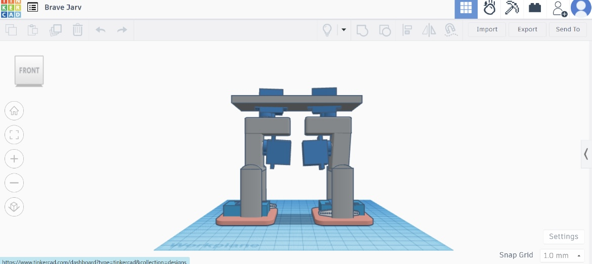
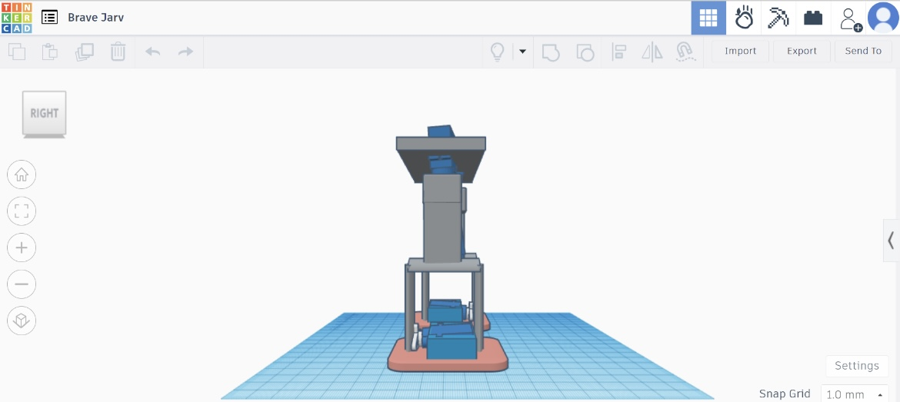
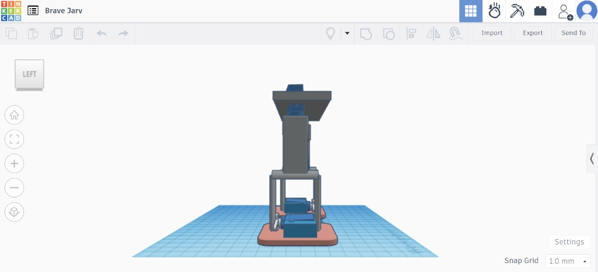
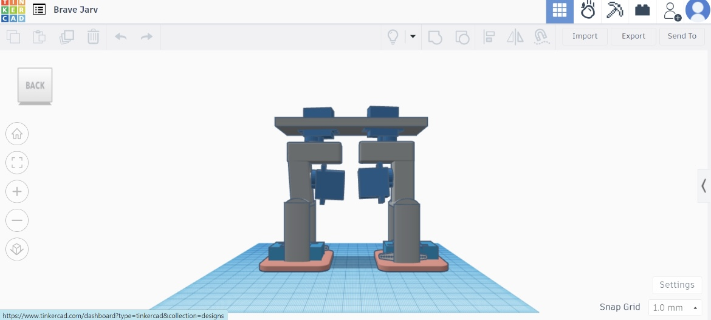
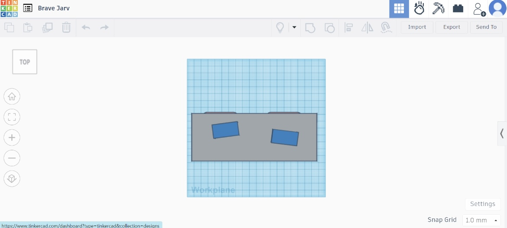
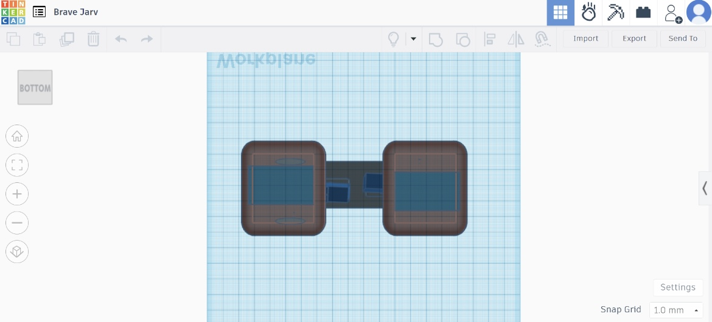

# 3D-Robot-Leg-Joints

In this project, we aim to design a 3D model of robot leg joints with servo motors. The servos are placed at the pelvis, knee, and foot joints to simulate realistic leg movements.

### Materials Used
- Tinkercad for 3D design
- 6 servo motors (2 for pelvis, 2 for knees, 2 for feet)

### Design Process
1. **Creating the Leg Structure**: 
    - Open Tinkercad and start a new 3D design project.
    - Design the basic structure of a leg with joints at the pelvis, knee, and foot.

2. **Adding Servo Motors**: 
    - Place one servo motor at the pelvis joint.
    - Place another servo motor at the knee joint.
    - Place the third servo motor at the foot joint.
    - Repeat for the second leg.

3. **Connecting the Servos**:
    - Connect each servo motor to its respective joint.
    - Ensure proper alignment and functionality within Tinkercad.

### Photos
1. **Front View**
    
2. **Right View**
    
3. **Left View**
    
4. **Back View**
    
5. **Top View**
    
6. **Bottom View**
    

   ### 3D Design Link
[Click here to view the 3D design on Tinkercad](https://www.tinkercad.com/things/lPtCfQpie4m-brave-jarv/edit?sharecode=3W7NCBTniuBr6eh-p6mvYCE5pPAHd1UYkqJv6DcLksE)
